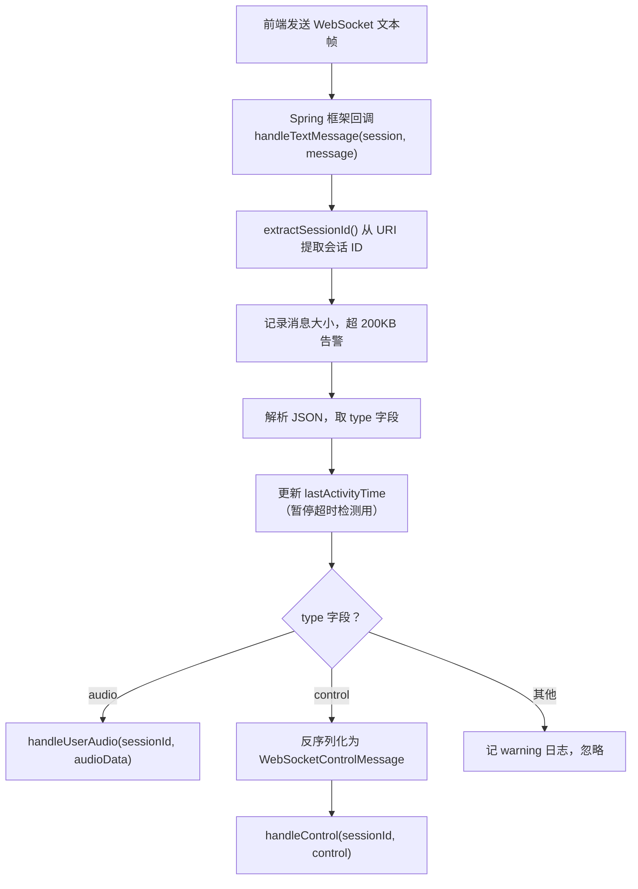
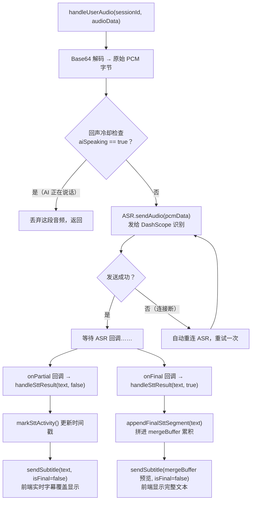
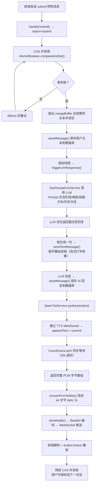
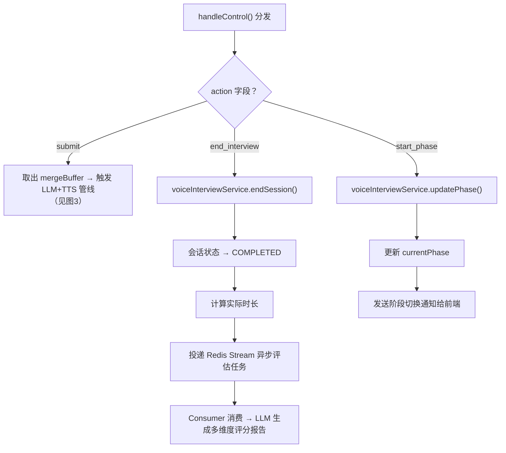

按流程拆成 4 个图。

---

### 图1：handleTextMessage —— WebSocket 消息总入口

```mermaid
flowchart TD
    A["前端发送 WebSocket 文本帧"] --> B["Spring 框架回调<br/>handleTextMessage(session, message)"]
    B --> C["extractSessionId() 从 URI 提取会话 ID"]
    C --> D["记录消息大小，超 200KB 告警"]
    D --> E["解析 JSON，取 type 字段"]
    E --> F["更新 lastActivityTime<br/>（暂停超时检测用）"]
    F --> G{"type 字段？"}

    G -- "audio" --> H["handleUserAudio(sessionId, audioData)"]
    G -- "control" --> I["反序列化为 WebSocketControlMessage"]
    I --> J["handleControl(sessionId, control)"]
    G -- "其他" --> K["记 warning 日志，忽略"]
```

---

### 图2：音频处理 —— 用户说话 → ASR 识别 → 字幕推送

```mermaid
flowchart TD
    A["handleUserAudio(sessionId, audioData)"] --> B["Base64 解码 → 原始 PCM 字节"]
    B --> C{"回声冷却检查<br/>aiSpeaking == true？"}
    C -- "是（AI 正在说话）" --> D["丢弃这段音频，返回"]
    C -- "否" --> E["ASR.sendAudio(pcmData)<br/>发给 DashScope 识别"]
    E --> F{"发送成功？"}
    F -- "是" --> G["等待 ASR 回调……"]
    F -- "否（连接断）" --> H["自动重连 ASR，重试一次"]
    H --> E

    G --> I["onPartial 回调 → handleSttResult(text, false)"]
    G --> J["onFinal 回调 → handleSttResult(text, true)"]

    I --> I1["markSttActivity() 更新时间戳"]
    I1 --> I2["sendSubtitle(text, isFinal=false)<br/>前端实时字幕覆盖显示"]

    J --> J1["appendFinalSttSegment(text)<br/>拼进 mergeBuffer 累积"]
    J1 --> J2["sendSubtitle(mergeBuffer 预览, isFinal=false)<br/>前端显示完整文本"]
```

---

### 图3：用户提交 —— LLM 回复 + TTS 语音管线

```mermaid
flowchart TD
    A["前端发送 submit 控制消息"] --> B["handleControl() → action=submit"]
    B --> C["CAS 并发锁<br/>AtomicBoolean.compareAndSet()"]
    C --> D{"拿到锁？"}
    D -- "否" --> E["400ms 后重试"]
    E --> C
    D -- "是" --> F["取出 mergeBuffer 全部累积文本并清空"]
    F --> G["saveMessage() 保存用户文本到数据库"]

    G --> H["虚拟线程 → triggerLlmResponse()"]
    H --> I["DashscopeLlmService 调用 LLM<br/>Prompt 包含阶段/难度/技能方向/历史对话"]
    I --> J["LLM 流式返回面试官回复"]
    J --> K["每生成一句 → sendTextMessage()<br/>推字幕给前端（流式打字效果）"]
    K --> L["LLM 完成 → saveMessage() 保存 AI 回复到数据库"]

    L --> M["QwenTtsService.synthesize(text)"]
    M --> M1["建立 TTS WebSocket → appendText + commit"]
    M1 --> M2["CountDownLatch 同步等待（30s 超时）"]
    M2 --> M3["返回完整 PCM 字节数组"]
    M3 --> N["convertPcmToWav() 添加 44 字节 WAV 头"]
    N --> O["sendAudio() → Base64 编码 → WebSocket 推送"]
    O --> P["前端解码 + AudioContext 播放"]

    P --> Q["释放 CAS 并发锁<br/>用户可继续说下一句话"]
```

---

### 图4：控制指令 —— end_interview / start_phase

```mermaid
flowchart TD
    A["handleControl() 分发"] --> B{"action 字段？"}

    B -- "submit" --> C["取出 mergeBuffer → 触发 LLM+TTS 管线<br/>（见图3）"]

    B -- "end_interview" --> D["voiceInterviewService.endSession()"]
    D --> D1["会话状态 → COMPLETED"]
    D1 --> D2["计算实际时长"]
    D2 --> D3["投递 Redis Stream 异步评估任务"]
    D3 --> D4["Consumer 消费 → LLM 生成多维度评分报告"]

    B -- "start_phase" --> E["voiceInterviewService.updatePhase()"]
    E --> E1["更新 currentPhase"]
    E1 --> E2["发送阶段切换通知给前端"]
```